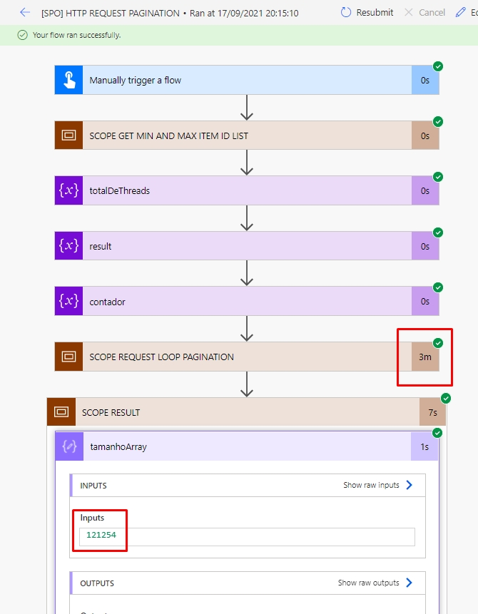
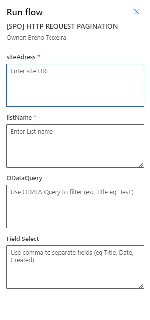

# Request HTTP Pagination

## Summary
In this example, the stream has a paging structure using the http request action with SharePoint.

The example demonstrates using 'forEach' to apply a pagination break by dividing the total of items (taking the first and last ID in the List) and dividing it into 5,000 rows per run.

## Requirements
- This stream needs a SharePoint Online List and has at least 1 item

## Sample

Input|Description
--------|---------
siteAdress | `Use URL site or subsite:` https://domain.sharepoint.com/
listName | `Use List name:` Sales Order
ODataQuery | `Use OData Query to filter fields:` Title eq 'Test' and ID ge 10
Field Select | `Use to get more fields in your query, use comma to separate fields:` Title, Category, Created

## Version history

Version|Date|Comments
-------|----|--------
1.0|September 17, 2021|Initial release

## Disclaimer
**THIS CODE IS PROVIDED *AS IS* WITHOUT WARRANTY OF ANY KIND, EITHER EXPRESS OR IMPLIED, INCLUDING ANY IMPLIED WARRANTIES OF FITNESS FOR A PARTICULAR PURPOSE, MERCHANTABILITY, OR NON-INFRINGEMENT.**